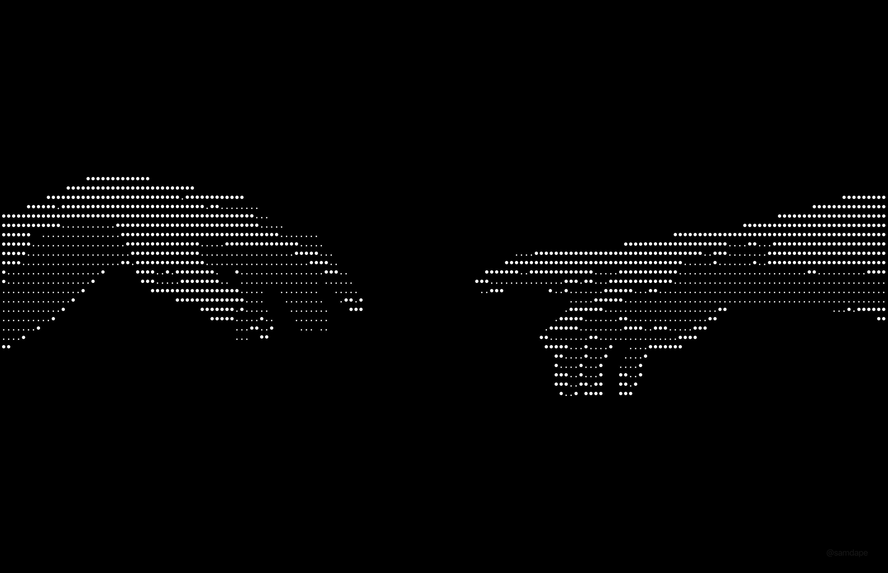
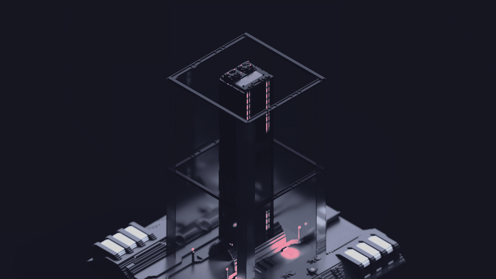
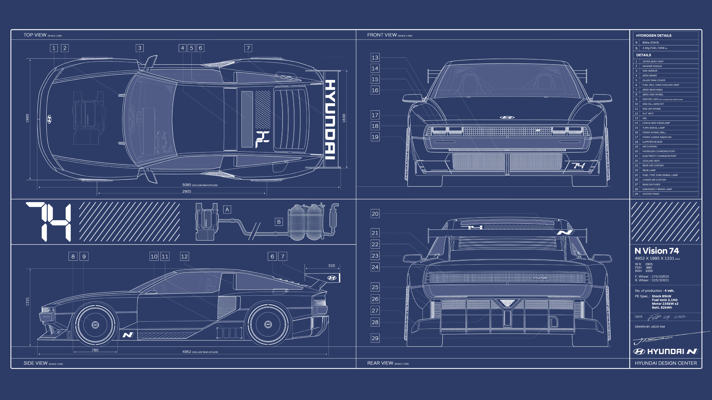
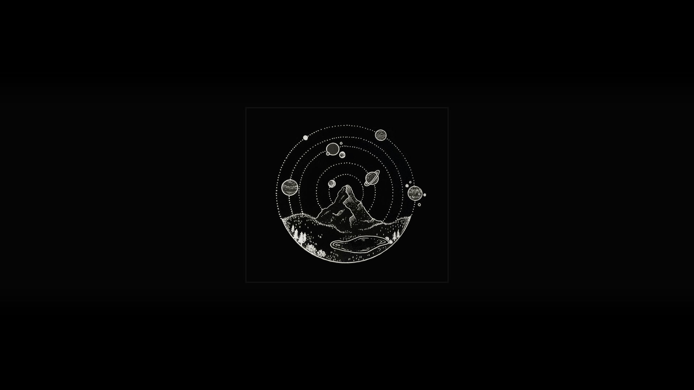
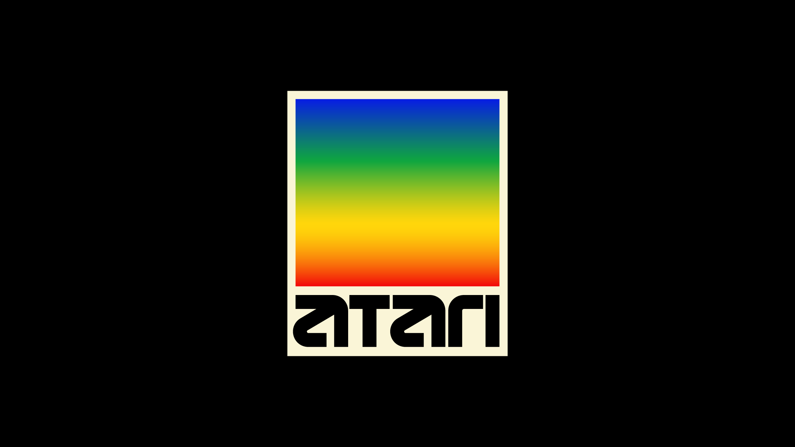
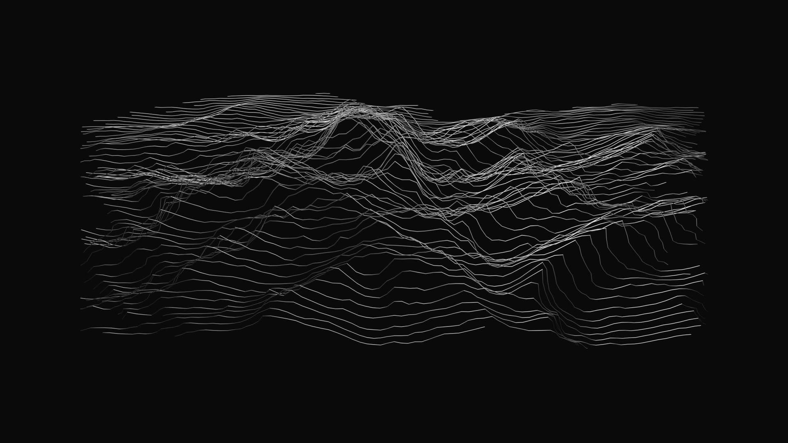
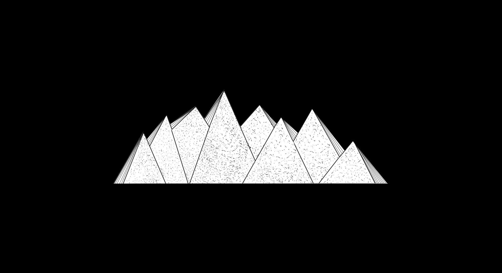

# 🌌 Invictus596's Hyprland Dotfiles

My personal dotfiles for [Hyprland](https://hyprland.org/), built on top of the excellent [end-4's dots-hyprland](https://github.com/end-4/dots-hyprland). This configuration has been specifically tailored for my daily workflow, featuring custom multi-monitor rules and hybrid GPU support.

## 🚀 Key Features
*   **Window Manager:** Hyprland
*   **Shell:** Fish 
*   **Terminal:** Kitty
*   **App Launcher & Power Menu:** Fuzzel & Wlogout
*   **UI & Aesthetics:** Quickshell, Matugen
*   **Hardware Setup:** Specially configured for Hybrid GPU systems and multi-monitor setups.
*   **Wallpapers:** A curated collection of personal wallpapers included in the `Wallpapers/` directory.

## 📁 Repository Structure
*   **`.config/hypr/`** - Hyprland configs, keybinds, multi-monitor rules, and environment variables.
*   **`.config/quickshell/`** & **`.config/illogical-impulse/`** - Core desktop shell and UI components.
*   **`.config/kitty/`** - Terminal emulator configuration.
*   **`.config/fish/`** - Shell customizations.
*   **`.config/matugen/`** - Material You color generation configurations.
*   **`Wallpapers/`** - My personal collection of high-res wallpapers.

## 🛠️ Installation

If you want to use parts of my configuration, you can clone this repository. 

> **Warning**: Since this setup includes hardware-specific rules (like my personal monitor arrangements and hybrid GPU environment variables), it is **highly recommended** to cherry-pick the configurations you need rather than blindly copying everything. Copying everything as-is might prevent your display server from starting properly!

```bash
git clone https://github.com/Invictus596/Dotfiles-Hyprland.git ~/Dotfiles-Hyprland
```

### Applying the configs
To apply the configurations, copy the folders from the `.config` directory into your own `~/.config` folder:
```bash
cp -r ~/Dotfiles-Hyprland/.config/* ~/.config/
```

### Applying the Wallpapers
You can move the wallpapers into your preferred wallpaper directory (e.g., `~/Pictures/Wallpapers`):
```bash
mkdir -p ~/Pictures/Wallpapers
cp -r ~/Dotfiles-Hyprland/Wallpapers/* ~/Pictures/Wallpapers/
```

## 🖼️ Wallpaper Previews

<details>
<summary>Click to view wallpapers</summary>

### 02-blue-teal.png


### 0jwpp2kqog0g1.jpeg


### 3d-model.jpg


### 4K-Black.png


### 4K-Original.png


### 4K-White.png


### 4k Windows Bloom Dark Variants R Wallpaper.png


### Bubbles_03_4K Alt.jpg


### Bubbles_03_4K Blue Planet.jpg


### Fire Watch.jpg


### Glass Panes Red.jpg


### a_black_and_white_logo.png


### a_black_background_with_a_white_line_drawing_of_a_mountain_and_planets.jpg


### a_blue_and_grey_background.png


### a_colorful_mask_on_a_black_background.jpg


### a_colorful_square_with_black_text.png


### a_computer_generated_image_of_a_machine.png


### a_sword_with_a_black_background.jpg


### a_tower_in_a_forest.png


### a_white_lines_on_a_black_background.jpeg


### a_white_pyramids_on_a_black_background.jpg


### bsod.png


### keyboard-2.png


</details>

## 🤝 Credits
A massive thanks to [end-4](https://github.com/end-4/dots-hyprland) for providing the stunning baseline architecture for these dotfiles!
